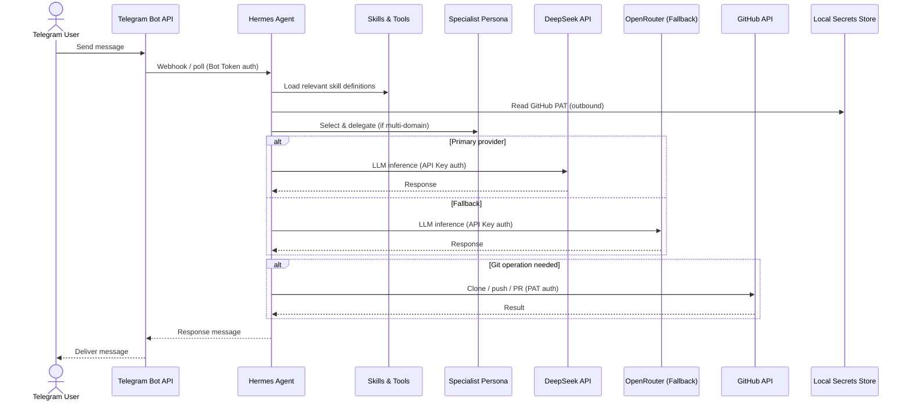
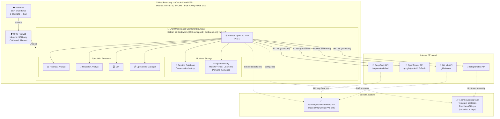

# Current Architecture

Mermaid architecture diagram for the self-hosted AI agent platform.

**Note:** This file is a source document for manual SVG export. The canonical editable source is `diagrams/current-architecture.drawio`.

---

## Architecture Overview

---

## Flow Diagram

---

## Trust Boundary Map

