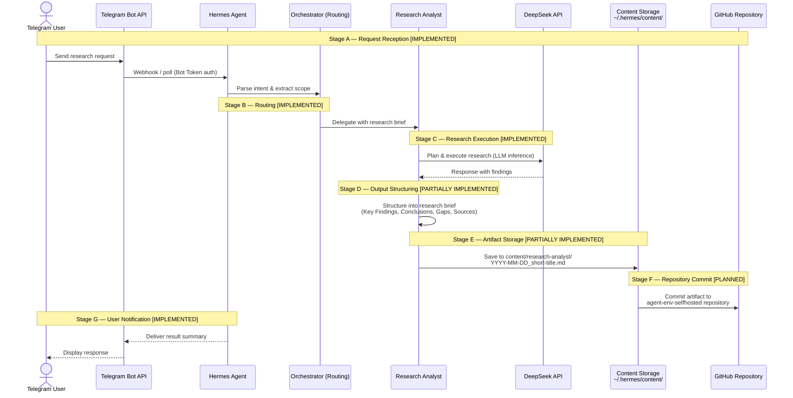

# Research Analyst — Execution Sequence

Mermaid sequence diagram showing the intended Research Analyst workflow. Each stage includes a status classification to distinguish implemented from planned functionality.

**Canonical source:** `docs/workflows/research-pipeline.md`

---

## Sequence Diagram

---

## Stage Status Key

| Icon | Status | Meaning |
|------|--------|---------|
| ✅ | **Implemented** | Component is operational and actively used. No additional work required. |
| 🟡 | **Partially Implemented** | Infrastructure exists (directories, naming conventions, tooling) but the full automated pipeline has not been exercised. Manual intervention or additional configuration may be required. |
| ⬜ | **Planned** | Component is designed and documented but not yet built. Cannot be used without implementation. |

---

## Stage-by-Stage Status

| Stage | Label | Status | Current Reality |
|-------|-------|--------|-----------------|
| A | Request Reception | ✅ **Implemented** | Telegram gateway is running (PID 15397), actively connected to Telegram API (3 established connections). Accepts and processes user messages. |
| B | Routing | ✅ **Implemented** | Orchestrator routing logic exists. Research Analyst SKILL.md is loaded and delegatable via `delegate_task`. |
| C | Research Execution | ✅ **Implemented** | Hermes Agent LLM provider (DeepSeek) is operational. OpenRouter fallback is configured. The agent can execute research tasks with web search and browser tools. |
| D | Output Structuring | 🟡 **Partially Implemented** | The persona definition documents the output structure (Key Findings, Conclusions, Gaps, Sources). The RA can produce structured responses in chat. However, no research artifacts have been saved to disk as standalone files. |
| E | Artifact Storage | 🟡 **Partially Implemented** | Content directory structure exists at `~/.hermes/content/research-analyst/` with documented naming convention (`YYYY-MM-DD_short-kebab-title.md`). The pipeline step (save → summarize → reference in chat) has been designed but never exercised — 0 files exist in any content directory. |
| F | Repository Commit | ⬜ **Planned** | The concept of committing final research artifacts to the repository is documented in the persona definition (Collaboration Rules → OM updates project memory). No automated commit pipeline exists. Manual git operations are possible but require explicit operator direction. |
| G | User Notification | ✅ **Implemented** | Hermes sends response messages to Telegram. The gateway is actively delivering responses. |
